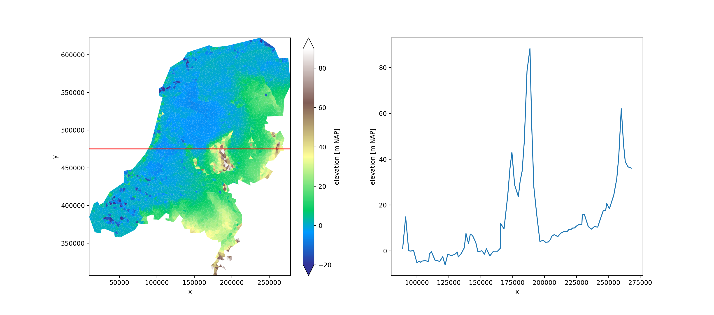

Xugrid
======

**This is a work in progress.**

Xarray extension to work with 2D unstructured grids, for data and topology
stored according to `UGRID conventions
<https://ugrid-conventions.github.io/ugrid-conventions>`_.

Processing structured data with xarray is convenient and efficient. The goal
of Xugrid (pronounced "kiss you grid" by `visionaries 🗢
<https://github.com/visr>`_ ) is to extend this ease to unstructured grids.

.. code:: python

   import matplotlib.pyplot as plt
   import xugrid

   # Get some sample data as a xugrid UgridDataArray
   uda = xugrid.data.elevation_nl()

   # Get a cross-section
   section_y = 475_000.0
   section = uda.ugrid.sel(y=section_y)

   # Plot unstructured grid and cross section
   fig, (ax0, ax1) = plt.subplots(figsize=(22.6, 10), ncols=2)
   uda.ugrid.plot(ax=ax0, vmin=-20, vmax=150, cmap="terrain")
   ax0.axhline(y=section_y, color="red")
   section.plot(ax=ax1, x="x")

Installation
------------

.. code:: console

   pip install xugrid

.. toctree::
   :titlesonly:
   :hidden:

   user_guide
   api
   dev_docs
